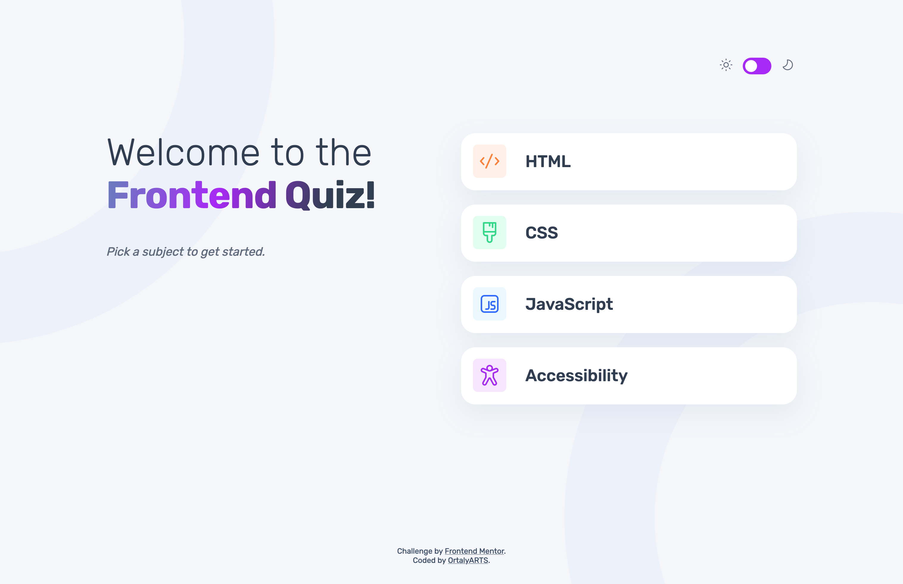

# Frontend Mentor - Frontend quiz app solution

This is a solution to the [Frontend quiz app challenge on Frontend Mentor](https://www.frontendmentor.io/challenges/frontend-quiz-app-BE7xkzXQnU). Frontend Mentor challenges help you improve your coding skills by building realistic projects. 

## Table of contents

- [Overview](#overview)
  - [The challenge](#the-challenge)
  - [Screenshot](#screenshot)
  - [Links](#links)
- [My process](#my-process)
  - [Built with](#built-with)
  - [What I learned](#what-i-learned)
  - [Continued development](#continued-development)
  - [Useful resources](#useful-resources)
- [Author](#author)
- [Acknowledgments](#acknowledgments)

**Note: Delete this note and update the table of contents based on what sections you keep.**

## Overview

### The challenge

Users should be able to:

- Select a quiz subject
- Select a single answer from each question from a choice of four
- See an error message when trying to submit an answer without making a selection
- See if they have made a correct or incorrect choice when they submit an answer
- Move on to the next question after seeing the question result
- See a completed state with the score after the final question
- Play again to choose another subject
- View the optimal layout for the interface depending on their device's screen size
- See hover and focus states for all interactive elements on the page
- Navigate the entire app only using their keyboard
- **Bonus**: Change the app's theme between light and dark

### Screenshot

### Links

- Solution URL: [Add solution URL here](https://your-solution-url.com)
- Live Site URL: [Add live site URL here](https://your-live-site-url.com)

## My process

### Built with

- Semantic HTML5 markup
- Native CSS
- Vanilla JavaScript
- Mobile-first workflow
- JSON to populate questions
- CSS animations (tansition + @keyframes)
- Light / Dark theme switch
- Aria role listbox + option to add accesibillity for selecting subjects
- CSS @media (prefers-reduced-motion) + Fallback in JavaScript 
- Chrome Screen reader - for accessibility check
- Chrome Lighthouse
- PerfectPixel

**Note: These are just examples. Delete this note and replace the list above with your own choices**

### Useful resources

- [Animated background on text](https://developer.mozilla.org/en-US/docs/Web/CSS/background-clip) + (https://www.frontendhero.dev/tutorial/mask-text-with-image/ )- Mask text with an image in CSS
- [role="listbox"](https://developer.mozilla.org/en-US/docs/Web/Accessibility/ARIA/Roles/listbox_role) - I used it for the selecting subject options
- [CSS gradien generator](https://cssgradient.io/)
- [Sparkles effect](https://youtu.be/BTzatHA9TD0?si=O9NmEAdSYEKy0F_I) - I used this tutorial as basis for the sparkle animation for the Score show.

## Author

- OrtalyARTS Portfolio Website - [@ortalyARTS.com](https://ortaly.com/)
- Frontend Mentor - [@ortalyARTS](https://www.frontendmentor.io/profile/ortalyARTS)
- Linkedin - [@ortalyARTS](www.linkedin.com/in/ortalyarts) 

